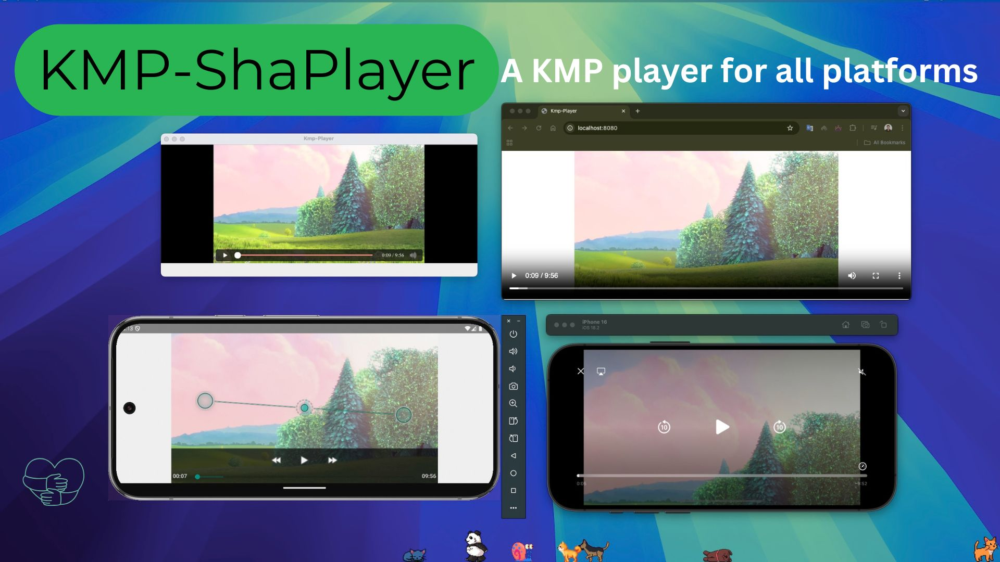

[](https://opensource.org/licenses/Apache-2.0)



<!-- GETTING STARTED -->
## Getting Started
### Adding dependencies
- Add it in your `commonMain.dependencies`
  ```
  implementation("io.github.shadmanadman:kmpShaPlayer:1.0.2")
  ```

### Usage  
```
@Composable
fun KmpShaPlayer(
    modifier: Modifier? = null,
    urlOrPathToFile: String,
    isLandscape: Boolean = false,
    stop: Boolean = false,
    onLoading: ((isLoading: Boolean) -> Unit) = {},
    onError: ((error: Throwable) -> Unit) = {}
)
```
- `urlOrPathToFile` : Takes a url or a path to a local file
- `isLandscape` : Forces the player to go landscape
- `onLoading` : Loading state
- `onError` : In case of a throwable


<h2 align="center">Make it easier for everyone</h2>
